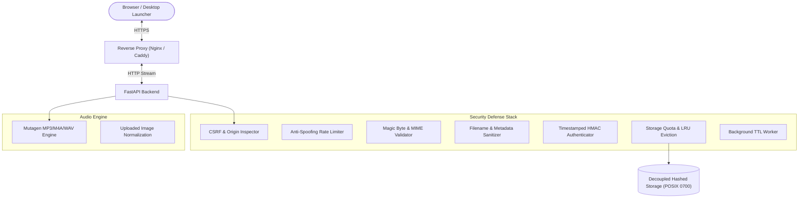

# MP3MetaFix 🎵

[](VERSION)
[](#license)
[-purple.svg)](#)

**MP3MetaFix** is a high-performance, security-focused audio metadata suite featuring a **Gateway Hub (`/`)**, an **Administrator Control Center (`/admin`)**, a **Mobile-First Focused Tagger (`/app`)**, and a **Desktop Power-User Manager Workspace (`/manager`)**. Designed for seamless local desktop usage on Fedora / Ubuntu and headless server deployment inside **Proxmox LXC containers** behind reverse proxies.

---

## Current status — v0.5.1

The editor supports MP3, M4A (AAC/ALAC/Opus), and WAV. MP3/WAV and synthetic AAC M4A checks pass; the reported real Suno M4A failure was resolved by accepting Opus-in-MP4. See the [roadmap](ROADMAP.md) for planned features.

The [v0.5.1 security remediation report](docs/SECURITY_REMEDIATION_2026-09-21.md) records verified fixes for artwork serving, upload admission, account recovery/revocation, updater locking, and outbound fetching. The local workstation now runs a verified dedicated-account system service with read-only application mounts; general installer account migration remains planned. Sign in again after upgrading. Where enabled, web updates install files and require a local service restart. They are disabled on the migrated read-only workstation deployment.

## ✨ Features

The editor’s version dialog supports update checks without a header update badge.

- 🌐 **Multi-Interface Architecture & Gateway Hub**:
  - **Gateway Hub (`/`)**: Compact workspace selector with a one-time health/version check and no telemetry quickbar or resource polling.
  - **Administrator Control Center (`/admin`)**: CPU, memory, disk, and temporary-storage diagnostics, refreshed while signed in as an administrator. Open it through the account menu’s **Admin Dashboard** link.
  - **MP3MetaFix (`/app`)**: Lightweight, mobile-first, single-track MP3, M4A, and WAV editor optimized for touchscreens and quick edits.
  - **MP3MetaManager (`/manager`)**: Desktop workspace shell with navigation and a coming-soon state. The integrated editor, batch spreadsheet, raw metadata inspector, and synced lyrics are planned. It must inherit every `/app` capability through the shared engine/API.
  - **Persistent App Switcher**: Header navigation pill allowing instant workspace jumping without context loss.
- 🎧 **MP3, M4A & WAV Tagging**:
  - MP3 ID3v2.3/v2.4, M4A AAC/ALAC/Opus native atoms, and WAV embedded ID3 tags with existing RIFF INFO text synchronization.
  - Edit tags and artwork without re-encoding; downloads always retain the original audio format.
  - Shared backend capabilities are available to `/manager` as its inspector is implemented.
  - M4A track/disc numbers, totals, and BPM require whole numbers from 0–65535; blank removes the value. Browser playback depends on codec support, and WAV tag/artwork support varies between players.
  - Track Title, Artist, Album, Album Artist, Genre, Year / Date
  - Track Number / Total Tracks, Disc Number / Total Discs, BPM, Composer
  - Comments & Unsynchronized Lyrics
- ⚡ **Configurable Canned Comments & Quick Presets**:
  - Quick-select preset dropdown to one-click populate comments (e.g. Suno creator profile URLs, attribution tags, mastering notes).
  - Quick "Save Current" action to save any typed comment as a reusable preset.
  - Built-in Presets Manager to add, edit, delete, and restore customizable presets persisted in `localStorage`.
- 🖼️ **Album Artwork Manager**:
  - Extract and inspect embedded APIC cover art.
  - Drag-and-drop cover art replacement (JPEG, PNG, WebP converted & normalized via Pillow).
  - Extract/download original cover art or remove it.
- 🔊 **Built-in Audio Preview & Interactive Waveform Scrubber**:
  - Native Web Audio API & Retina Canvas waveform rendering dynamic peak amplitudes.
  - Multi-color gradient playback state (cyan/purple played, slate/indigo upcoming).
  - Continuous drag scrubbing, click-to-seek, hover time guide, and keyboard shortcuts.
  - HTTP 206 Partial Content Range streaming support.
- 💾 **Native Save & File System Access**:
  - Native browser save folder picker via the modern File System Access API (`showSaveFilePicker`).
  - Seamless fallback to direct named downloads with RFC 5987 UTF-8 Content-Disposition headers.
- ⚡ **Dynamic Filename Formatter**:
  - Automatically rename downloaded audio files using patterns like `%artist% - %title%.mp3` or `%track% - %title%.mp3`.
- 🔐 **Full System Authentication & Access Control**:
  - **Protected Editing APIs by Default**: File-editing APIs require login unless Guest Mode is enabled. Static pages/assets and health/version endpoints are public; frontend login prompts are not backend authorization.
  - **First-Run Administrator Setup Wizard**: Automated setup prompt on first launch to create the primary administrator account with zero manual config file editing.
  - **Configurable Guest Mode**: Administrator can enable Guest Mode in Settings to allow public/guest access to the Gateway Hub (`/`) and Single-Track Editor (`/app`), while keeping MP3MetaManager (`/manager`), system telemetry diagnostics, and server settings locked.
  - **Zero-Dependency Security**: Standard-library PBKDF2-HMAC-SHA256 password hashing (600,000 rounds) + constant-time comparison.
  - **Distinct Trust Boundaries**: Independent signed cookie layers for account identity (`mp3metafix_auth`) and temporary file sessions (`mp3metafix_session`).
  - **In-App Settings**: Password changes and Guest Mode are implemented. Quota/TTL preferences are stored, but runtime limits currently come from environment configuration; do not assume saving settings changes those limits.
- 🛡️ **Implemented Security Controls (with open audit findings)**:
  - **Cryptographic Session Cookies**: Timestamped HMAC-SHA256 signed `HttpOnly`, `SameSite=Lax` session cookies.
  - **Decoupled Hashed Storage**: Session directories isolated via one-way SHA-256 hashes (`SHA-256(secret:uuid)[:32]`).
  - **POSIX 0700 Isolation**: Multi-user permissions hardening on temporary storage.
  - **Storage Quota Precheck**: LRU eviction for session storage; combined with early request-byte limits, a cross-process writer lease, and atomic-save headroom checks.
  - **Upload Rate Limiting**: Per-worker sliding window with proxy IP anti-spoofing; runs before multipart parsing.
  - **CSRF & Safe DOM Rendering**: Fetch-site/origin checks and safe metadata text rendering; embedded artwork is normalized before serving.
  - **Uploaded Image Checks**: hard 10-million-pixel and 4096px dimension checks, including embedded artwork previews.
  - **Exception Masking**: Generic errors on normal editing paths; the updater emits fixed status text instead of raw logs or exception details.
  - **Service Templates**: Include resource restrictions; inspect the installed unit. The current user service has verified filesystem and resource restrictions; it still uses the desktop Unix account.
- 🐧 **Smart Universal Linux Installer (`install.sh`)**:
  - Automatically detects your distro (`dnf`, `apt`, `pacman`).
  - Installs and enables a **systemd background service** (`mp3metafix.service`) to start automatically on system boot.
  - Automatically registers **Desktop application launcher** (`.desktop`) and high-res icon for GUI environments.
  - Supports `--update` with automated, non-destructive legacy service migration (`scripts/migrate_service.py`), `--status`, `--uninstall`, `--no-service`, and custom ports.

---

## 🚀 Installation & Service Setup

### 1. Install as a Systemd Service (Recommended)

To install MP3MetaFix so it runs continuously in the background and **starts automatically on system boot**:

```bash
# Clone the repository
git clone https://github.com/darktekmafia/MP3MetaFix.git
cd MP3MetaFix

# Run the installer (installs systemd service & desktop integration)
sudo ./install.sh
```

Once installed, MP3MetaFix runs as a native systemd background service:
- **Web Interface**: Open `http://127.0.0.1:8844` (or your server's IP)
- **Desktop Launcher**: Available in your Application Menu (GNOME/KDE/XFCE)

The current development workstation uses a **user service**: use `systemctl --user status/restart/stop mp3metafix.service` and `journalctl --user -u mp3metafix.service`. The commands below apply to system-wide installations. See [deployment notes](docs/DEPLOYMENT.md) for the duplicate-unit issue.

#### Service Management Commands
```bash
# Check service status
sudo systemctl status mp3metafix.service

# View live application logs
sudo journalctl -u mp3metafix.service -f

# Restart or stop the service
sudo systemctl restart mp3metafix.service
sudo systemctl stop mp3metafix.service
```

---

### 2. Manual / Ad-hoc Development Mode

If you are developing or testing changes and prefer running a temporary foreground server without installing a system service:

```bash
./run.sh
```
The server will run in your active terminal session and stop when you press <kbd>Ctrl</kbd> + <kbd>C</kbd>.

---

### 3. Installer Options & Maintenance

```bash
./install.sh [OPTIONS]
```

| Flag | Description |
|------|-------------|
| `--install` | Default: Installs dependencies, sets up systemd service, and adds desktop integration |
| `--update` | Pulls latest Git updates, updates python dependencies, and restarts the systemd service |
| `--status` | Checks systemd service status, configured bind, proxy trust, and HTTP health |
| `--access` | Displays current network binding, proxy trust status, and reachable LAN URLs |
| `--lan` | Switches service to listen on all network interfaces (`0.0.0.0`) for LAN reachability |
| `--local` | Switches service to listen on localhost only (`127.0.0.1`) |
| `--bind <HOST>` | Sets custom bind host (e.g. `0.0.0.0`, `127.0.0.1`, or specific IP) |
| `--proxy [IPS]` | Enables reverse proxy trust (optionally specifying trusted proxy IP/subnets) |
| `--domain <DOMAIN>` | Sets reverse proxy domain/hostname or public URL (informational reachability probe & access links) |
| `--no-domain` | Clears configured reverse proxy domain/hostname |
| `--no-proxy` | Disables reverse proxy trust (ignores forwarded headers) |
| `--trusted-proxies <IPS>` | Sets explicit comma-separated trusted proxy IPs/CIDRs |
| `--uninstall` | Stops and removes systemd service, desktop entries, and launchers |
| `--no-service` | Skips systemd service registration (standalone mode) |
| `--headless` | Force Headless / Server / LXC mode (skips GUI desktop entries) |
| `--desktop` | Force Desktop mode (ensures app menu launcher & icon are created) |
| `--port <PORT>` | Custom port (default: `8844`) |
| `--user <USER>` | Specify user for systemd service (default: current user) |
| `--help`, `-h` | Shows help message |
| `--version`, `-v` | Prints current version |

---

## 🌐 Proxmox LXC & Reverse Proxy Deployment

For hosting inside a Proxmox LXC (Ubuntu/Debian) behind Nginx, Caddy, or standalone on a local network:

1. In your LXC container:
   ```bash
   git clone https://github.com/darktekmafia/MP3MetaFix.git /opt/mp3metafix
   cd /opt/mp3metafix
   sudo ./install.sh --headless --port 8844
   ```
2. Enable LAN access or inspect access endpoints:
   ```bash
   sudo ./install.sh --lan    # Enable LAN access across all interfaces (0.0.0.0)
   ./install.sh --access      # View detected network endpoints & service health
   ```
3. Set up your reverse proxy using the provided templates in `deploy/`:
   - [Nginx Configuration](deploy/nginx.conf)
   - [Caddyfile](deploy/Caddyfile)

Detailed deployment instructions are documented in [docs/DEPLOYMENT.md](docs/DEPLOYMENT.md).

---

## 🏗️ Architecture



For in-depth technical documentation, see [docs/ARCHITECTURE.md](docs/ARCHITECTURE.md), [docs/SECURITY_HARDENING.md](docs/SECURITY_HARDENING.md), and [docs/SUNO_TOS_COMPLIANCE.md](docs/SUNO_TOS_COMPLIANCE.md).

---

## ⌨️ Keyboard Shortcuts

| Shortcut | Action |
|----------|--------|
| <kbd>Ctrl</kbd> + <kbd>S</kbd> / <kbd>Cmd</kbd> + <kbd>S</kbd> | Save changes and download modified audio |

---

## 🗺️ Master Product Roadmap & Sub-Projects

MP3MetaFix features dedicated sub-project roadmaps tailored to each interface's target user persona and device context:
- **[Gateway Hub (`/`) Roadmap](ROADMAP.md#-project-a-gateway-hub---system-portal--dispatcher-roadmap)**: Workspace selection and guest access; live diagnostics are consolidated in `/admin`.
- **[MP3MetaFix (`/app`) Roadmap](ROADMAP.md#-project-b-mp3metafix-app--mobile-first-single-track-editor-roadmap)**: Mobile-first single-track editor, Suno URL auto-parser, Web Share API, and PWA manifest.
- **[MP3MetaManager (`/manager`) Roadmap](ROADMAP.md#-project-c-mp3metamanager-manager--desktop-power-user-workspace-roadmap)**: Desktop power-user batch spreadsheet, stem tree organizer, and tap-to-sync karaoke timestamping (`.lrc` / `SYLT`).
- **[Core Platform (`/api`) Roadmap](ROADMAP.md#-project-d-core-platform-security--infrastructure-roadmap)**: Multi-arch Docker images, native Windows executable, and multi-format audio engine.

See [ROADMAP.md](ROADMAP.md) for full details.

---

## License

Declared project license: MIT © 2026 MP3MetaFix Contributors. A standalone LICENSE file is currently missing from this checkout; maintainers should add the authorized license text before distribution.

### Local service-account migration (unreleased)

A scoped [local migration helper](docs/ACCOUNT_MIGRATION.md) can move the standard developer user service to a dedicated non-login account while preserving data. It requires administrator authentication and keeps the checkout read-only for the backend. A recovered failed attempt can use the documented retry action, which probes the real system sandbox before stopping the working backend. General guided account selection/creation and existing system-service migration remain roadmap work.
